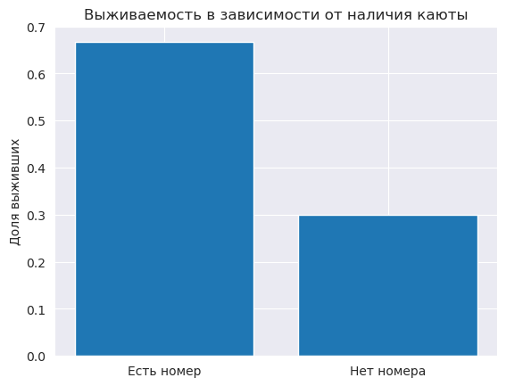
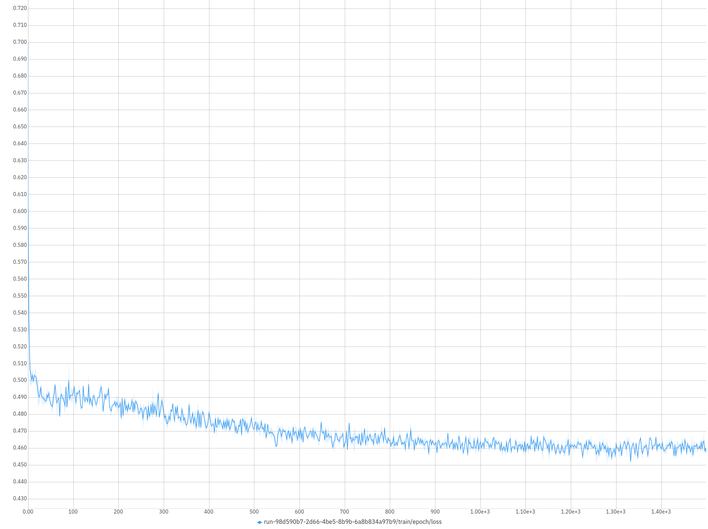

# Titanic Survivors Data Research

---
## Содержание
1. [Введение](#intro)
2. [Анализ данных](#analys)
   1. [Исходные данные](#source_d)
   2. [Факторы, влияющие на шансы выжить](#factors)
   3. [Пол и класс каюты](#sex)
   4. [Возраст](#age)
   5. [Имена и возраст](#names)
   6. [Номер каюты](#cabin)
   7. [Родственники на борту](#rel)
   8. [Билеты и порт отправления](#tickets)
3. [Построение модели](#model)
    1. [Формирование признаков (features)](#features)
    2. [Data preprocessing](#prepr)
    3. [Структура нейронной сети](#net)
    4. [Обучение](#learning)
4. [Заключение](#conclusion)
5. [Список источников](#links)

---
## Введение <div id='intro'/>

15 апреля 1912 года произошло крушение парохода «Титаник», став одной из самых значимых катастроф в истории человечества. За сто лет с момента затопления лайнера, в мире накопилось множество данных и работ по этой теме. На сайте Kaggle.com существует соревнование [1], в основе которого лежат данные о пассажирах с Титаника. Катастрофа сложилась так, что некоторые пассажиры выживали с большим шансом, чем другие, и это отражено в данных, полученых в рамках соревнования.

Целью данной работы является создание предиктивной модели, которая на основе данных о пассажире сможет предсказать, выжил он после крушения Титаника или нет. В первом разделе будет рассмотрен разведовательный анализ исходных данных пассажиров, а также проектирование признаков для последующего использования в модели машинного обучения. Второй раздел включает в себя подготовку данных, описание структуры используемой модели, результаты обучения модели.

---

## Анализ данных <div id='analys'/>
Целью раздела "Анализ данных" является разведовательный анализ данных, выявление и проверка гипотез, инжиниринг признаков (feature engineering) для модели машинного обучения.

Все примеры кода и графика продублированы из файла `Data_Investigation.ipynb`.
### Исходные данные <div id='source_d'/>
Исходные данные представлены в виде .csv файла, образующего таблицу (891 строка, 12 столбцов), представленную на рисунке 1 ниже. Мы можем наблюдать следующие данные для каждого из пассажиров: класс, полное имя, пол, возраст, количество родственников супруг+братья\сестры, количество родственников родители+дети, номер билета, стоимость билета, номер каюты, порт отправления, выжил пассажир или нет.
```
import pandas as pd

# Считаем файл с данными
df = pd.read_csv('train.csv')
# Взглянем на данные!
df
```


Сразу отметим следующие особенности этих данных (виузализацию см. в файле `Data_Investigation.ipynb`): 
1. Пропущено около 20% данных о возрасте пассажиров.
2. Пропущено около 80% данных о каютах пассажиров.
3. У 15 пассажиров нулевая стоимость билетов.
4. У 2 пассажиров отсутствует порт отправления.
5. У 4 пассажиров нет номеров билетов.

### Факторы, влияющие на шансы выжить <div id='factors'/>
За более чем сто лет с момента катастрофы, было проведено множество исследований, в том числе статистических. В [2] и [3] описаны ключевые моменты, влияющие на выживаемость пассажиров:
1. **Пол** (выжило 75% женщин и 16% мужчин [2]).
2. **Возраст** (выжило 52% детей [2]).
3. **Класс каюты** (выжило из 1 класса 62%, из 2 - 41%, из 3 - 25% [2]).

Первое и второе обусловлено тем, как проводилась эвакуация пассажиров. По приказу капитана в первую очередь в шлюпки сажали женщин и детей [4, 5].

Влияние класса на выживаемость выражалось в общей привелегированности 1 класса над вторым и третьим, и второго класса над третьим [2]. Конкретно стоить отметить, что:
1. Каюты 1 класса располагались ближе всего к палубе [2].
2. Первый класс обслуживали 2 лифта, второй класс - 1 лифт, третий класс лифты не обслуживали вообще [2].
3. На пароходе не было системы оповещения, поэтому о необходимости эвакуироваться людям сообщали стюарды. Причем в 1 классе на одного стюарда приходилось всего несколько кают, а во 2 и 3 - много больше [7]. В первом классе стюарды имели возможность лично помочь и выпроводить каждого пассажира [7], а в третьем классе стюарды просто выбивали двери в каюты [6], и сообщали о том, что нужно выбираться на палубу.

Далее рассмотрено влияние отдельных факторов на выживаемость в рамках исследуемых данных.

### Пол и класс каюты <div id='sex'/>
Посчитаем общее количество и количество выживших для мужчин и женщин, визуализируем на диаграмме.
```
import matplotlib.pyplot as plt
import numpy as np

# Посчитаем общее количество мужчин и женщин, а также количество выживших
males_total = len(df.loc[(df['Sex'] == 'male')])
females_total = len(df.loc[(df['Sex'] == 'female')])
males_survived = len(df.loc[((df['Sex'] == 'male') & (df['Survived'] == 1))])
females_survived = len(df.loc[((df['Sex'] == 'female') & (df['Survived'] == 1))])

#Визуализируем
survivors_counts = {
    'Выжили': [males_survived, females_survived],
    'Погибли': [males_total-males_survived, females_total-females_survived]
}

fig, ax = plt.subplots()
bottom = np.zeros(2)

for key, count in survivors_counts.items():
    p = ax.bar(('Мужчины', 'Женщины'), count, width=0.6, label=key, bottom=bottom)
    bottom += count
    ax.bar_label(p, label_type='center')

ax.set_title('Распределение выживших в зависимости от пола')
ax.set_ylabel('Количество человек')
ax.legend()
plt.show()
```


В процентном соотношении получаем числа, аналогичные упомянутым ранее [2, 3]:
* Выжило мужчин: 18.89%
* Выжило женщин: 74.2%

Построим аналогичную диаграмму для различных классов каюты (код см. в файле `Data_Investigation.ipynb`).


В процентном соотношении:
* Выжило из 1 класса: 62.96%
* Выжило из 2 класса: 47.28%
* Выжило из 3 класса: 24.24%

Таким образом, пол и класс каюты будут одними из ключевых факторов (и признаков для модели), влияющих на вероятность выжить.

### Возраст <div id='age'/>
Рассмотрим распределение пассажиров по возрастам, а также распределение выживших, мужчин и женщин по возрастам.
```
from collections import Counter

#Выберем списки пассжиров в отдельные группы
survivors = df.loc[(df['Survived'] == 1)]
male_survivors = df.loc[((df['Sex'] == 'male') & (df['Survived'] == 1))]
female_survivors = df.loc[((df['Sex'] == 'female') & (df['Survived'] == 1))]

#Число возрастов
num_of_ages = len(dict(Counter(survivors['Age'])).keys())

#Визуализируем
fig, axs = plt.subplots(2,2)
fig.set_figwidth(20)
fig.set_figheight(10)
names = [['Все пассажиры', 'Выжившие'], ['Выжившие мужчины', 'Выжившие женщины']]
for i, surv in enumerate([[df, survivors], [male_survivors, female_survivors]]):
    for j, subsurv in enumerate(surv):
        axs[i][j].hist(subsurv['Age'], bins=num_of_ages)
        axs[i][j].set_title(names[i][j])
        axs[i][j].set_xlabel('Возраст, лет')
        axs[i][j].set_ylabel('Количество человек')
        axs[i][j].set_ylim(0,30)
        axs[i][j].set_xlim(0,70)
plt.show()
```


На каждой диаграмме можно заметить 2 характерные моды: одна соответствует детям, а другая людям с возрастом 20-30 лет. Причем на всех диаграммах распределение сохраняет свой характер, хоть при этом и смещается μ, падают амплитуды. Видно, что в зависимости от возраста количество выживших значительно разнится, поэтому возраст будет важным признаком при построении модели.\
Попробуем также убедиться, что большая часть детей спаслись.

```
import numpy as np

children = df.loc[((df['Age'] < np.float64(18.0)) & (df['Age'] > 0))]
survivors_children = df.loc[((df['Age'] < np.float64(18.0)) & (df['Survived'] == 1) & (df['Age'] > 0))]
print(f'Пасажиров до 18 лет спаслось {round(len(survivors_children)*100/len(children), 2)}%')
```

* Пасажиров до 18 лет спаслось 53.98%.\

Действительно, более половины детей спаслось. Причём, если мы еще раз посмотрим на диаграммы, то видно, что больше всего спаслось детей до 5 лет.

```
df.loc[((df['Survived'] == 1) & (df['Age'] > 0) & (df['Age'] < 18))].Age.hist()
```


### Имена и возраст <div id='names'/>

Имена пассажиров содержат характерные для 1912 годп приставки, такие как "Mr", "Mrs", "Miss", "Sir", "Master" и другие. Эти приставки отражают информацию о возрасте и статусе человека [8]. Автор [9] в ходе своего анализа данных пассажиров "Титаника" подтвердил, что статус человека, отражённый в имени, тесно коррелирует с возрастом, и эту взаимосвязь можно использовать для определения возраста пассажиров, возраст которых в исходных данных пропущен. Отобразим зависимость возраста от титула в виде набора коробчатых диаграмм.
```
#Перечень титулов
titles = ("Capt.","Col.","Major.","Sir.","Lady.","Rev.","Dr.","Don.","Jonkheer.","Countess.","Mrs.","Ms.","Mr.","Mme.","Mlle.","Miss.","Master.")

#Создадим список титулов для каждого пассажира
titled_names = []
for name in df.Name:
    for title in titles:
        if title in name.split(' '):
            titled_names.append(title)
            break


#Добавим в датафрейм новый столбец - Титул
df.insert(12, 'Title', titled_names)

#Создадим словарь с парами "титул: список возрастов"
ages = dict.fromkeys(titles, [])
for i, title in enumerate(df.Title):
    if not pd.isna(df.Age[i]):
        ages[title] = ages[title] + [df.Age[i]]

#Визуализируем
fig, ax = plt.subplots(figsize=(15,5))
ax.boxplot(ages.values(), labels=titles, vert=True)
ax.set_ylabel('Возраст')
plt.show()
```


Прежде, чем восстанавливать отсутствующие возраста, рассмотрим отдельно пассажиров без указания возраста. Возраст людей может быть неизвестен не только потому, что они его изначально не сообщили, но и потому что погибли и не смогли сообщить его после катастрофы. Посмотрим на соотношение погибших и выживших среди этих пассажиров, а также на соотношение мужчин и женщин среди пассажиров без возраста.
```
noage = df.loc[(pd.isna(df['Age']))]
fig, ax = plt.subplots(1, 2, figsize=(10,5))
ax[0].hist(noage.Survived, bins=2, cumulative=-1)
ax[1].hist(noage.Sex, bins=2)
ax[0].set_ylabel('Кол-вол выживших')
```


Можно увидеть, что среди пассажиров без возраста больше погибших потому, что среди них больше мужчин. Однако разумно будет добавить в данные признак `have_age`, отражающий наличие\отсутствие указания возраста пассажира, поскольку у мужчины без указания возраста шансы погибнуть будут еще больше, чем просто у мужчины, это должно прибавить точности модели.

Восстановим возраста, используя медиану среди пассажиров с соответствующим титулом.
```
for i, age in enumerate(df.Age):
    if pd.isna(age):
        df.Age[i] = np.median(ages[df.Title[i]])
```


Выживаемость в зависимости от титула\
Автор [9] также предложил распределить титулы в 5 групп: Aristocratic, Mr, Mrs, Miss и Master (объединяя вместе родственные [8] группы), а затем посмотреть на выживаемость среди пассажиров с разным титулом.
```
# Группы для объединения
aristocratic = ("Capt.", "Col.", "Don.", "Dr.",
                "Jonkheer.", "Lady.", "Major.",
                "Rev.", "Sir.", "Countess.")
mrs = ("Ms.")
miss = ("Mlle.", 'Mme.')

# Объединяем титулы
for i, title in enumerate(df.Title):
    if title in aristocratic:
        df.Title[i] = 'Aristocratic.'
    elif title in miss:
        df.Title[i] = 'Miss.'
    elif title in mrs:
        df.Title[i] = 'Mrs.'

# В данном случае будет удобно посмотреть на долю выживших, так как количество людей в каждом из титулов значительно разнится
title_survive_percent = dict.fromkeys(set(df.Title), None)
for title in title_survive_percent.keys():
    title_survive_percent[title] = len(df.loc[((df['Title'] == title) & (df['Survived'] == 1))]) / len(df.loc[(df['Title'] == title)])

#Визуализируем
fig, ax = plt.subplots()
ax.bar(title_survive_percent.keys(), title_survive_percent.values())
ax.set_ylabel('Доля выживших')
ax.set_title('Выживаемость в зависимости от титула пассажира')
plt.show()
```


Видно, что титул даёт информацию о вероятности выжить, так что он будет иметь значение при построении модели.

### Номер каюты <div id='cabin'/>

Среди номеров каюты пропущены данные для 80% пассажиров. Восстановить эти данные не представляется возможным. Для тех же пассажиров, для которых номер каюты известен, можно было бы извлечь номер палубы и на каком борту была каюта (буква в номере соответствует палубе, нечетные номера соответствуют левому борту [7]). Однако, учитывая малое количество данных, это существенно не повлияет на точность модели [9].

Сведения о каютах пассажиров стали известны благодаря списку, найденному на теле погибшего стюарта Герберта Кейва, причем в список были включены только пассажиры первого класса [10]. Это означает, что значение может иметь само наличие или отсутствие данных о каюте пассажира.
```
# Выделим пассажиров в группы
have_cabin = df.loc[(pd.notna(df['Cabin']))]
have_cabin_survived = df.loc[((pd.notna(df['Cabin'])) & (df['Survived'] == 1))]
no_cabin = df.loc[(pd.isna(df['Cabin']))]
no_cabin_survived = df.loc[((pd.isna(df['Cabin'])) & (df['Survived'] == 1))]

# Визуализируем долю выживших
fig, ax = plt.subplots()
ax.bar(('Есть номер', 'Нет номера'), (len(have_cabin_survived)/len(have_cabin), len(no_cabin_survived)/len(no_cabin)))
ax.set_ylabel('Доля выживших')
ax.set_title('Выживаемость в зависимости от наличия каюты')
plt.show()
```



Действительно, видим, что наличие номера кабины у пассажира влияет на выживаемость. В [9] автор также рассматривает этот признак в разрезе по полу и классу каюты, и значимость признака подтверждается.

### Родственники на борту <div id='rel'/>

Различные авторы сходятся на том, что признаки "Родители+дети" и "Супруг+братья\сестры" стоит объединить в один признак "Семья", а также добавить признак "Пассажир путешествовал один" [9, 11, 12, 13, 14]. Чтобы составить собственное представление о влиянии этих признаков на выживаемость, построим диаграммы выживаемости для каждого из таких признаков, а затем взглянем на них через призму таблицы корреляции.
```
# Добавим признак family
#df.insert(13, 'Family', np.array(df.SibSp, int) + np.array(df.Parch, int))


sibsp_total = dict(Counter(df.SibSp))
parch_total = dict(Counter(df.Parch))
family_total = dict(Counter(df.Family))
sibsp_survived = dict(Counter(df.loc[(df['Survived'] == 1)].SibSp))
parch_survived = dict(Counter(df.loc[(df['Survived'] == 1)].Parch))
family_survived = dict(Counter(df.loc[(df['Survived'] == 1)].Family))
relatives = (family_total, sibsp_total, parch_total)
relatives_survived = (family_survived, sibsp_survived, parch_survived)

fig, axs = plt.subplots(1, 3, figsize=(15,5))
xlabs = ('Полное число родственников', 'Супруг+братья\сестры', 'Родители+дети')

for i in range(3):
    probs = []
    for rel, amount in relatives_survived[i].items():
        probs.append(amount / relatives[i][rel])
    axs[i].bar(relatives_survived[i].keys(), probs)
    axs[i].set_ylabel('Доля выживших')
    axs[i].set_xlabel(xlabs[i])
plt.show()
```


```
import seaborn as sns

# Добавим признак is_alone
is_alone = []
for fam in df.Family:
    if fam == 0:
        is_alone.append(1)
    else:
        is_alone.append(0)
df.insert(14, 'is_alone', is_alone)

# Correlation heatmap
sns.heatmap(df[['Survived', 'SibSp', 'Parch', 'Family', 'is_alone']].corr(), annot=True, vmin=-1, vmax=1, cmap=sns.diverging_palette(0, 500, as_cmap=True))
```


Как видно из гистограмм и таблицы выше, количество родственников хоть и влияет на выживаемость, но по отдельности коррелируют слабо. Будет разумно оставить только признак 'Family' и 'is_alone'.

### Билеты и порт отправления <div id='tickets'/>

Стоимость билета, очевидно, будет коррелировать с классом каюты, а следовательно, влиять на вероятность выжить. Построим таблицу корреляции.

```
sns.heatmap(df[['Survived', 'Fare', 'Pclass']].corr(), annot=True, vmin=-1, vmax=1)
```


Стоимость билета оказывается хорошим признаком, влияющим на выживаемость. В дальнейшем также очистим этот признак от выбросов. А теперь построим диаграмму с распределением по стоимости билетов для каждого класса.

```
fare = dict.fromkeys((1,2,3), [])
for i, price in enumerate(df.Fare):
    fare[df.Pclass[i]] = fare[df.Pclass[i]] + [price]


fig, ax = plt.subplots(figsize=(15,5))
ax.boxplot(fare.values(), labels=(1,2,3), vert=True)
ax.set_ylabel('Стоимость билета')
ax.set_xlabel('Класс каюты')
ax.set_ylim(-5, 250)
plt.show()
```


Из коробчатых диаграмм видно, что для каждого из классов есть своё характерное распределение по стоимости. Заменим билеты с нулевой стоимостью на медианную стоимость для соответствующего класса.

```
for i, fare in enumerate(df.Fare):
    if np.isclose(fare, .0):
        df.Fare[i] = np.median(fares[df.Pclass[i]])
```

«Здесь и ранее - идея заменять пропущенные значения какими-то усредненными величинами обосновывается стремлением оставить распределение данных примерно таким же, и не генерировать граничных/экстремальных значений, т.к. подобные выбросы могли бы увести алгоритмы прогнозирования в сторону от реального решения, давая не существующие ориентиры [14].»

Номер билета не несёт информации, способствующей предсказанию выживаемости, поэтому формировать какие-либо признаки на его основе не будем.

Пропущенные два значения порта отправления заменим на средние, тем более, что номер билета подсказывает такое же значение порта.
```
for i, emb in enumerate(df.Embarked):
    if pd.isna(emb): df.Embarked[i] = 'S'
```

## Построение модели <div id='model'/>

### Формирование признаков (features) <div id='features'/>
Пол, класс каюты, возраст, наличие возраста, титул, наличие номера кабины, количество членов семьи, один ли пассажир, стоимость билета, порт отправления

В ходе анализа были отобраны качественные признаки для модели. Такими стали: Sex, Pclass, Age, Have_Age, Title(векторизованно), Have_Cabin, Family, Is_Alone, Fare, Embarked(векторизованно).

Следующий код конвертирует исходные данные в датасет признаков для тренировочного и тестового наборов.

```
import pandas as pd
import numpy as np

TITLES = ("Capt.","Col.","Major.","Sir.","Lady.","Rev.","Dr.","Don.","Jonkheer.","Countess.","Mrs.","Ms.","Mr.","Mme.","Mlle.","Miss.","Master.", "Dona.")
ARISTOCRATIC = ("Capt.", "Col.", "Don.", "Dr.",
                "Jonkheer.", "Lady.", "Major.",
                "Rev.", "Sir.", "Countess.", 'Dona')
MRS = ("Ms.")
MISS = ("Mlle.", 'Mme.')

for file in ('train', 'test'):

    # Считываем файл
    dataset = pd.read_csv(f'{file}.csv')

    # Кодируем пол
    dataset = dataset.replace({'female' : 1, 'male': 0})

    # Восстанавливаем стоимость билетов
    dataset.Fare.fillna(0, inplace = True)
    fares = dict.fromkeys((1,2,3), [])
    for i, price in enumerate(dataset.Fare):
        fares[dataset.Pclass[i]] = fares[dataset.Pclass[i]] + [price]
    for i, fare in enumerate(dataset.Fare):
        if np.isclose(fare, .0):
            dataset.loc[i, 'Fare'] = np.median(fares[dataset.Pclass[i]])

    #Создадим список титулов для каждого пассажира
    titled_names = []
    for name in dataset.loc[:, 'Name']:
        for title in TITLES:
            if title in name.split(' '):
                titled_names.append(title)
                break

    # Вставляем в датасет столбец Title
    dataset.insert(1, 'Title', titled_names)

    #Создадим словарь с парами "титул: список возрастов"
    ages = dict.fromkeys(TITLES, [])
    for i, title in enumerate(dataset.Title):
        if not pd.isna(dataset.Age[i]):
            ages[title] = ages[title] + [dataset.Age[i]]
            
    # Создаем признак Семья
    dataset['Family'] = dataset.Parch + dataset.SibSp

    # Кодируем бинарные признаки
    dataset['Is_Alone'] = dataset.Family == 0
    dataset['Have_Cabin'] = pd.notna(dataset.Cabin)
    dataset['Have_age'] = pd.notna(dataset.Age)
    dataset = dataset.replace({True: 1, False: 0})

    # Восстанавливаем пропущенные возраста
    for i, age in enumerate(dataset.loc[:, 'Age']):
        if pd.isna(age):
            dataset.loc[i, 'Age'] = np.median(ages[dataset.Title[i]])

    # Объединяем титулы
    for i, title in enumerate(dataset.Title):
        if title in ARISTOCRATIC:
            dataset.loc[i, 'Title'] = 'Aristocratic.'
        elif title in MISS:
            dataset.loc[i, 'Title'] = 'Miss.'
        elif title in MRS:
            dataset.loc[i, 'Title'] = 'Mrs.'

    # Восстанавливаем порт отправления
    dataset.Embarked.fillna(dataset.Embarked.mode()[0], inplace = True)

    # Кодируем порт и титулы
    dataset = dataset.join(pd.get_dummies(dataset.Embarked, prefix='Emb'))
    dataset = dataset.join(pd.get_dummies(dataset.Title, prefix='Title'))

    # Чистим от лишних столбцов
    dataset = dataset.drop(columns=['Ticket', 'Name', 'SibSp', 'Parch', 'Cabin', 'Title', 'Embarked'])

    # Перемещаем столбец Survived в конец
    try:
        dataset.insert(dataset.shape[1] - 1, 'Survived', dataset.pop('Survived'))
    except KeyError:
        ...

    dataset.to_csv(f'clear_{file}.csv', index=False)
```

Построим таблицу корреляции всех отобранных признаков.

```
train_set = pd.read_csv('clear_train.csv')

fig, ax = plt.subplots(figsize=(15,15))
sns.heatmap(train_set.corr(), annot=True, vmin=-1, vmax=1, ax=ax)
```


### Data preprocessing <div id='prepr'/>

Для того, чтобы изначально повысить эффективность обучения, нормализуем данные. Для этого объединим тренировочный и тестовый набор в один датафрейм и используем следующую формулу для преобразования ячеек в каждом столбце.


Нормализация реализована в файле `data_functions.py` в виде следующей функции.

```
def normalize_data(train_vector: np.ndarray, test_vector: np.ndarray) -> tuple[np.ndarray, np.ndarray]:

    train_arr, test_arr = train_vector, test_vector
    united_arr = np.concatenate((train_arr, test_arr))

    mean = np.mean(united_arr, axis=0)
    std_deviation = np.std(united_arr, axis=0)

    train_X = (train_arr - mean) / std_deviation
    test_X = (test_arr - mean) / std_deviation

    return train_X, test_X
```


Для загрузки данных в модель создадим класс на основе структуры Dataset из pyTorch (см. файл `data_functions.py`).

### Структура нейронной сети <div id='net'/>

Структура выбранной сети выглядит следующим образом:

1. Входной слой: 16 нейронов (соответствует размерности входных данных).
2. Первый скрытый слой: 512 нейронов (с применением функции активации ReLU).
3. Батч-нормализация с 512 признаками.
4. Dropout-слой с вероятностью исключения нейронов 0.3 (30%).
5. Второй скрытый слой: 2048 нейронов (с применением функции активации ReLU).
6. Dropout-слой с вероятностью исключения нейронов 0.3 (30%).
7. Третий скрытый слой: 512 нейронов (с применением функции активации ReLU).
8. Dropout-слой с вероятностью исключения нейронов 0.3 (30%).
9. Выходной слой: 2 нейрона (с применением функции активации Softmax).

В коде эта нейросеть описана следующим образом (файл `networks.py`):

```
import torch.nn as nn
import torch.nn.functional as F


class Net(nn.Module):
    def __init__(self):
        super(Net, self).__init__()

        self.layer_1 = nn.Linear(16, 512)
        self.b_norm = nn.BatchNorm1d(512)
        self.layer_2 = nn.Linear(512, 2048)
        self.layer_3 = nn.Linear(2048, 512)
        self.layer_4 = nn.Linear(512, 2)

        self.dropout = nn.Dropout(0.3)

    def forward(self, x):
        x = self.layer_1(x)
        x = F.relu(x)
        x = self.dropout(x)
        x = self.b_norm(x)

        x = self.layer_2(x)
        x = F.relu(x)
        x = self.dropout(x)

        x = self.layer_3(x)
        x = F.relu(x)
        x = self.dropout(x)

        x = self.layer_4(x)
        x = F.softmax(x)

        return x
```

Визуализация структуры нейронной сети:


Нейронная сеть состоит из трех полносвязных слоев, между которыми расположены слои для регуляризации и нормализации. Техники батч-нормализации и Dropout использованы для предотвращения переобучения (overfitting). В выходном слое применяется функция активации Softmax для получения вероятностного распределения между двумя классами (выжил/погиб).

### Обучение <div id='learning'/>

Обучение нейросети проводилось в файле `learning.py`. С выбранной структурой нейронной сети, наибольших успехов на тестовых данных удалось достичь со следующими параметрами обучения. **Точность на валидационной выборке составила более 0.9**.

<table border="1"> <tr> <th>Параметр</th> <th>Значение</th> <th>Описание</th> </tr> <tr> <td>num_epochs</td> <td>1500</td> <td>Количество эпох обучения</td> </tr> <tr> <td>batch_size</td> <td>64</td> <td>Размер пакета данных (batch)</td> </tr> <tr> <td>learning_rate</td> <td>0.01</td> <td>Скорость обучения (learning rate)</td> </tr> <tr> <td>weight_decay</td> <td>0.01</td> <td>Коэффициент уменьшения весов (L2 регуляризация)</td> </tr> <tr> <td>validation_split</td> <td>0.1</td> <td>Доля данных, выделенных для валидации</td> </tr> <tr> <td>optimizer</td> <td>Adam</td> <td>Тип оптимизатора</td> </tr> <tr> <td>annealing_factor</td> <td>0.6</td> <td>Фактор уменьшения скорости обучения (LR annealing)</td> </tr> <tr> <td>loss_function</td> <td>CrossEntropyLoss</td> <td>Тип функции потерь</td> </tr> </table>

В процессе обучения был использован LR Annealing, для которого задан фактор уменьшения скорости обучения 0.6 и количество эпох (patience) равное 100. Если значение функции потерь не уменьшалось в течение 100 эпох, скорость обучения уменьшалась на заданный фактор.

Далее представлены графики обучения сети с заданной структурой и параметрами. После [этого обучения](https://new-ui.neptune.ai/pas-zhukov/Titanic-Kaggle/runs/details?viewId=standard-view&detailsTab=charts&shortId=TIT-26&type=run), на тестовых данных сеть показала точность [0.787](https://www.kaggle.com/paszhukov/competitions).

<p float="left">
   
   
</p>

<p float="left">
   
   
</p>

## Заключение <div id='conclusion'/>

В работе был проведен анализ данных пассажиров парохода "Титаник", выявлено влияние различных факторов на вероятность человека выжить в катастрофе. Выбранные факторы обработаны и преобразованы для использования в нейронной сети. После построения и обучения модели нейросети на предоставленных данных результативность обученной модели на тестовых данных составила 0.78.

Ключевые факторы, влияющие на выживаемость пассажиров Титаника, были определены следующими: пол пассажира, возраст, класс каюты, наличие номера каюты, количество родственников на борту, путешествовал ли пассажир в одиночку. Использование нейросетевой модели позволило учесть сложные взаимодействия между этими факторами и предсказать вероятность выживания каждого пассажира с приемлемой точностью.

Для возможного улучшения модели, можно дополнительно исследовать исходные данные, попробовать включать и не включать различные из отобранных признаков, рассмотреть различные архитектуры нейронных сетей, варьировать гиперпараметры обучения, а также попробовать другие алгоритмы машинного обучения, такие как решающие деревья или алгоритмы на основе ансамбля, в целях увеличения точности предсказания выживаемости.

## Список источников <div id='links'/>

1. Kaggle. Titanic: Machine Learning from Disaster [Электронный ресурс]. — Режим доступа: https://www.kaggle.com/competitions/titanic/. — Дата обращения: 02.04.2022.
2. Рахманов, А. В. Катастрофа Титаника: социально-классовая структура и шансы на спасение / А. В. Рахманов // Вестник Московского университета. Серия 18. Социология и политология. — 2016. — № 22. — С. 62-82.
3. Encyclopedia Titanica. Titanic Statistics [Электронный ресурс]. — Режим доступа: https://www.encyclopedia-titanica.org/titanic-statistics.html. — Дата обращения: 02.04.2022.
4. Gleicher, D. The Rescue of the Third Class on the Titanic: A Revisionist History / David Gleicher. — International Maritime Economic History Association, 2006. — (Research in Maritime History, No. 31). — ISBN 978-0-9738934-1-0.
5. Лорд, У. A Night to Remember / Уолтер Лорд. — Нью-Йорк: St. Martin's Griffin, 2005. — ISBN 978-0-8050-7764-3.
6. Barczewski, S. Titanic: A Night Rememb / Stephanie Barczewski. — Лондон: Continuum International Publishing Group, 2006. — ISBN 978-1-85285-500-0.
7. Губачек, М. С. Титаник / Милош Губачек. — Минск: Попурри, 2000. — 656 с. — ISBN 978-985-15-1679-3.
8. Википедия. English honorifics [Электронный ресурс]. — Режим доступа: https://en.wikipedia.org/wiki/English_honorifics. — Дата обращения: 02.04.2022.
9. Хабр. Титаник на Kaggle: вы не дочитаете этот пост до конца [Электронный ресурс]. — Режим доступа: https://habr.com/en/company/mlclass/blog/270973/. — Дата обращения: 02.04.2022.
10. Encyclopedia Titanica. The Cave List [Электронный ресурс]. — Режим доступа: https://www.encyclopedia-titanica.org/the-cave-list.html. — Дата обращения: 02.04.2022.
11. Хабр. Разбор задачи Титаник на Kaggle (Baseline) [Электронный ресурс]. — Режим доступа: https://habr.com/en/post/655955/. — Дата обращения: 02.04.2022.
12. ITnan. Kaggle и Titanic — еще одно решение задачи с помощью Python [Электронный ресурс]. — Режим доступа: https://itnan.ru/post.php?c=1&p=274171. — Дата обращения: 02.04.2022.
13. Neurohive. Разбор решения задачи «Титаник» на Kaggle для начинающих [Электронный ресурс]. — Режим доступа: https://neurohive.io/ru/osnovy-data-science/razbor-resheniya-zadachi-titanik-na-kaggle-dlya-nachinajushhih/. — Дата обращения: 02.04.2022.
14. Kaggle. Titanic Solution - a Beginner's Guide (Russian) [Электронный ресурс]. — Режим доступа: https://www.kaggle.com/code/adavydenko/titanic-solution-a-beginner-s-guide-russian/. — Дата обращения: 02.04.2022.


